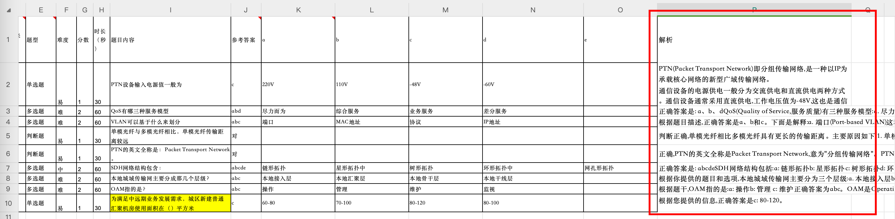
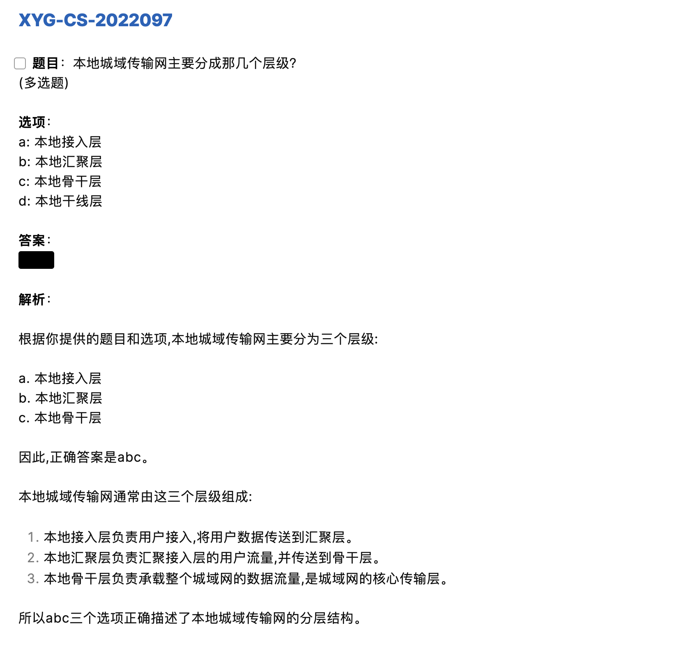
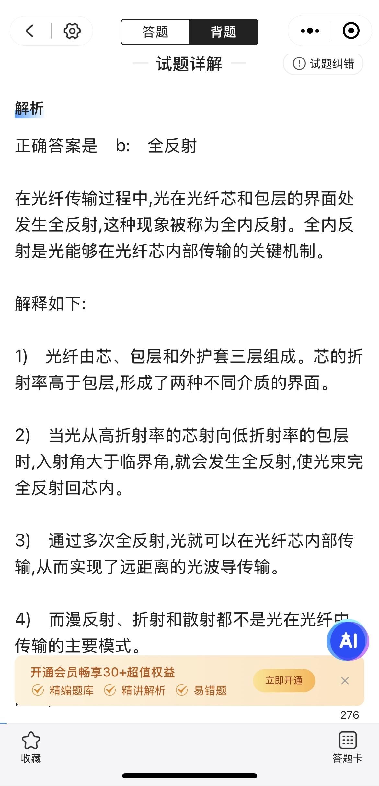

## 功能

- 从 Excel 文件中读取没有答案解析的试题，并使用 ChatGPT、Claude 等大模型的 API 生成答案解析。
- 支持处理单选题、多选题、判断题。
- 将处理好的 Excel 试题数据格式化为 Markdown 文件方便查看学习。

> 注意：使用大模型生成的答案解析仅供参考，因为模型有概率会出现幻觉。实测使用 Claude 系列的模型要比 ChatGPT 系列的模型效果更好，但不同领域可能有差别。

## 使用

### 依赖

使用以下命令安装所需的库：

```bash
pip install -r requirements.txt
```

### 配置

修改 `config.py` 文件，配置 `api_key` 、 `base_url` 、 `model_name` 的值。注意，第三方 API 服务需要兼容 OpenAI 接口协议。

可根据需要修改提示词 `prompt_str` 的内容。

### 运行

默认处理项目根目录下的 `test-data.xlsx` 文件，如需处理其他文件，请在 `main.py` 文件中修改文件路径。

```bash
python main.py
```

### 效果

运行完成后，会在目录下生成 `result.xlsx` 文件，其中带有答案解析：



### 后续处理

可使用 `format_excel_to_md.py` 将处理好的 Excel 试题数据格式化为 Markdown 文件方便查看学习。

```bash
python format_excel_to_md.py
```

运行完成后，会在目录下生成 `formatted.md` 文件，可在 Markdown 编辑器中打开学习：



也可以直接将生成的带有答案解析的 Excel 文件导入“考试宝“等背题软件中进行学习：


